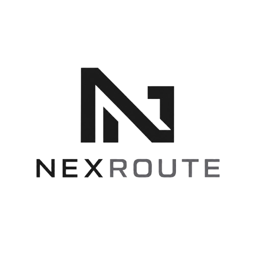

<p align="center">
  
</p>

<p align="center">
  Gateway routing AI yang berjalan lokal di mesinmu satu endpoint kompatibel OpenAI untuk banyak penyedia.
</p>

Colok tool apa pun yang sudah bisa bicara ke API OpenAI (Cursor, editor, skrip
sendiri), dan biarkan NexRoute yang memilih model, merotasi kredensial, serta
menangani kegagalan di belakang layar.

Semua data (kunci, log, statistik) disimpan di SQLite lokal. Tidak ada telemetri,
tidak ada layanan pihak ketiga yang menyimpan datamu.

## Fitur

- **Endpoint kompatibel OpenAI** — `POST /v1/chat/completions` dan `GET /v1/models`.
  Klien cukup diarahkan ke NexRoute alih-alih langsung ke penyedia.
- **Universal Format Translator** — NexRoute secara otomatis dan instan menerjemahkan lalu lintas dari dan ke penyedia seperti Anthropic (Claude), Google Gemini, Google Vertex AI, Ollama (Local AI), dan penyedia *custom* apa pun.
- **Routing & Alias Routing** — strategi virtual `auto` / `fast` / `smart` / `cheap`, atau model spesifik. Mendukung rute *Bypass Alias* (`/v1/alias/:alias/v1/messages`) untuk mengecoh SDK kaku (seperti Claude Code) agar mau menggunakan rute dinamis NexRoute.
- **Multi-akun per penyedia + fallback** — satu penyedia bisa punya banyak kredensial.
  Kalau satu akun kena rate-limit, kehabisan kuota, atau error, NexRoute otomatis
  pindah ke akun/penyedia berikutnya dengan dukungan pelacakan tingkat (Tier-based Quota Tracking).
- **Manajemen model** — atur prioritas, skor kualitas & kecepatan, biaya per token,
  dan kapabilitas (mis. vision) tiap model.
- **Kunci API masuk** — buat kunci untuk tiap klien dan (opsional) wajibkan autentikasi.
- **Analitik pemakaian** — grafik permintaan, token, dan biaya menurut waktu.
- **Penghemat token (RTK)** — mengompres keluaran panjang sebelum diteruskan.
- **Modifier LLM Cerdas (Ponytail/Caveman/Branding)** — menyisipkan instruksi ringkas (*system prompt*) agar model menjawab sependek mungkin, bergaya kasual, atau mengidentifikasi diri mereka sebagai **NexRoute buatan bromanprjkt**.
- **Kompatibilitas klien coding** — menyuntik `reasoning_content` untuk model thinking
  (DeepSeek/Kimi) dan membuang tool duplikat (seperti Cursor).
- **Dasbor web** — kelola semuanya lewat antarmuka yang modern dan intuitif.

## Tumpukan teknologi

- **Backend**: Fastify + Drizzle ORM + SQLite (libsql)
- **Frontend**: React + Vite + Tailwind CSS
- **Monorepo**: npm workspaces (`apps/*` dan `packages/*`)

## Struktur proyek

```
apps/
  api/         Server Fastify — rute /v1 & /api, mesin orkestrasi, layanan
  web/         Dasbor React
packages/
  core/        Tipe bersama + mesin routing (murni, tanpa I/O)
  providers/   Adaptor penyedia (OpenAI / Anthropic / Gemini)
  shared/      Placeholder tipe lintas paket
docs/          Dokumentasi teknis (lihat docs/arsitektur.md)
```

## Kebutuhan

- Node.js >= 20
- npm >= 10

## Instalasi & menjalankan

```bash
git clone <url-repo>
cd nexroute
npm install
cp .env.example .env      # sesuaikan bila perlu
npm run dev
```

- Server API: `http://127.0.0.1:3000`
- Dasbor web: `http://localhost:5173`

Skema database dibuat otomatis saat server pertama kali dijalankan — tidak perlu
migrasi manual untuk sekadar mencoba. Untuk build produksi:

```bash
npm run build
```

## Konfigurasi

Berkas `.env` di root hanya berisi setelan dasar:

```env
PORT=3000
DATABASE_URL=file:./data/nexroute.db
```

Kunci API penyedia **tidak** disimpan di `.env` — semuanya dikelola lewat dasbor dan
tersimpan di database lokal.

## Menyiapkan penyedia

1. Buka dasbor, masuk ke **Penyedia**, tambahkan penyedia (mis. OpenAI) dan isi API Key.
2. Opsional: tambahkan beberapa **akun** pada satu penyedia untuk rotasi & fallback.
3. Masuk ke **Model**, tambahkan model yang ingin dipakai (mis. `gpt-4o`,
   `claude-sonnet-4`, `gemini-2.5-pro`), lalu atur prioritas, skor, dan biayanya.

## Integrasi Klien (AI Agents)

Arahkan klien AI apa pun ke NexRoute seolah-olah ia adalah penyedia OpenAI atau Anthropic lokal. Bila autentikasi kunci diaktifkan di NexRoute, pastikan Anda menyertakan kunci API tersebut.

### 1. Claude Code
Claude Code menggunakan SDK Anthropic yang sangat kaku dan menolak nama model di luar daftarnya. Gunakan rute **Alias Bypass** di URL agar validasi internal Claude Code berhasil dilewati, dan NexRoute akan menimpanya menjadi `auto` di belakang layar.

Jalankan perintah ini di terminal (contoh untuk PowerShell):
```powershell
$env:ANTHROPIC_MODEL="claude-3-5-sonnet-20241022"
$env:ANTHROPIC_BASE_URL="http://127.0.0.1:3000/v1/alias/auto"
$env:ANTHROPIC_API_KEY="<kunci-opsional>"

claude
```
*(NexRoute akan otomatis menangkap kata `auto` pada URL dan membuang `claude-3-5-sonnet-20241022`)*

### 2. Antigravity IDE
Antigravity memiliki pengaturan model yang fleksibel. Anda cukup mengarahkannya ke server NexRoute lokal via konfigurasi *OpenAI-Compatible*.
1. Buka konfigurasi **Model Provider** di Antigravity (atau gunakan tombol pengaturan LLM).
2. Pilih penyedia **OpenAI Custom**.
3. **Base URL**: `http://127.0.0.1:3000/v1`
4. **Model Name**: `auto` (atau `fast`, `smart`, `cheap`)
5. **API Key**: `kunci-nexroute-anda`

### 3. Cursor (AI Code Editor)
1. Buka **Settings > Models** di Cursor.
2. Tambahkan **OpenAI Custom Base URL**.
3. Isi Base URL dengan: `http://127.0.0.1:3000/v1`
4. Isi API Key dengan kunci NexRoute Anda (atau apa saja jika autentikasi NexRoute dimatikan).
5. Pada kotak teks model kustom di atas, ketik: `auto`, klik **Add**, dan centang untuk mengaktifkannya. (Bisa juga menambahkan `fast` atau `smart`).

### 4. Skrip Kustom & cURL
Gunakan format OpenAI standar untuk menembak NexRoute:

```bash
curl http://127.0.0.1:3000/v1/chat/completions \
  -H "Content-Type: application/json" \
  -H "Authorization: Bearer <kunci-opsional>" \
  -d '{
    "model": "auto",
    "messages": [
      { "role": "user", "content": "Halo, apa kabar?" }
    ]
  }'
```

## Routing

Model virtual mengarahkan permintaan secara dinamis:

- `auto` — ke model aktif dengan prioritas tertinggi.
- `fast` — ke model dengan skor kecepatan tertinggi.
- `smart` — ke model dengan skor kualitas tertinggi.
- `cheap` — ke model termurah.
- `penyedia/model` — lewati routing, minta model tertentu secara langsung.

## Pengujian

Berkas tes diletakkan bersebelahan dengan kode sumbernya (`*.test.ts`), bukan di folder
terpisah. Jalankan semuanya dengan:

```bash
npm run test
```

## Kontribusi

Kontribusi terbuka. Sebelum mengirim pull request, pastikan `npm run lint` dan
`npm run test` lolos.

## Lisensi

GPL.
